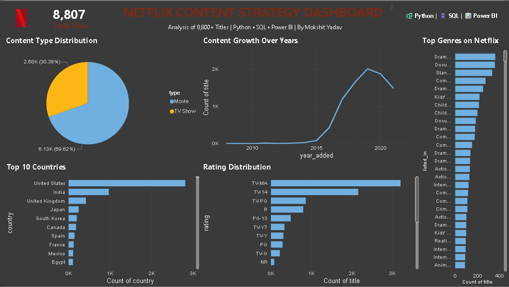

# netflix-content-strategy-analysis
Netflix Content Strategy &amp; Trend Analysis using Python, SQL and Power BI
# 🎬 Netflix Content Strategy & Trend Analysis


## 📌 Project Overview
An end-to-end Data Science project analyzing 8,800+ Netflix titles to uncover 
content trends, regional gaps, and strategic insights using Python, SQL, 
and Power BI.

---

## 🎯 Key Findings
- 🎬 **69.6%** of Netflix content is Movies, **30.4%** is TV Shows
- 🇺🇸 **USA** leads with 2,818 titles, 🇮🇳 **India** is 2nd with 972 titles
- 📈 Content grew **3x** between 2016-2019
- 🎭 **Drama & International** content dominates Netflix library
- 🤖 K-Means clustering identified **4 distinct content segments**

---

## 🛠️ Tools & Technologies
| Tool | Purpose |
|------|---------|
| Python (Pandas, NumPy) | Data cleaning & analysis |
| Matplotlib & Seaborn | Data visualization |
| Scikit-Learn | K-Means clustering ML model |
| SQL (SQLite) | Data querying & analysis |
| Power BI | Interactive dashboard |
| Git & GitHub | Version control |

---

## 📁 Project Structure
netflix-content-strategy-analysis/
│
├── 📄 netflix_analysis.py      — Main Python analysis code
├── 📊 netflix_titles.csv       — Original dataset (8,807 titles)
├── 📊 netflix_cleaned.csv      — Cleaned dataset
├── 📊 netflix_clustered.csv    — ML clustering results
├── 📁 charts/                  — All visualizations
│   ├── 01_movies_vs_tvshows.png
│   ├── 02_top_countries.png
│   ├── 03_content_per_year.png
│   ├── 04_top_genres.png
│   ├── 05_ratings.png
│   └── 06_kmeans_clusters.png
├── 📁 sql/
│   └── netflix_queries.sql     — SQL analysis queries
└── 📊 Netflix_Dashboard.pbix   — Power BI Dashboard

## 📊 Dashboard Preview



---

## 🔍 Analysis Steps
1. **Data Loading & Exploration** — Loaded 8,807 Netflix titles with 12 columns
2. **Data Cleaning** — Handled 2,634 missing directors, standardized formats
3. **Exploratory Data Analysis** — Created 5 visualizations for key insights
4. **K-Means Clustering** — Segmented content into 4 clusters using ML
5. **SQL Analysis** — Ran 6 queries to extract business insights
6. **Power BI Dashboard** — Built interactive dashboard with 5 visuals

---

## 🚀 How to Run
```bash
# Clone the repository
git clone https://github.com/MokshitYadav/netflix-content-strategy-analysis.git

# Install dependencies
pip install pandas numpy matplotlib seaborn scikit-learn

# Run the analysis
python netflix_analysis.py
```

---

## 👤 Author
**Mokshit Yadav**
- 📧 mokshityadav21@gmail.com
- 💼 linkedin.com/in/mokshit-yadav
- 🎓 BBA Finance | NDIM, GGSIPU

---

## ⭐ If you found this project helpful, please give it a star!
